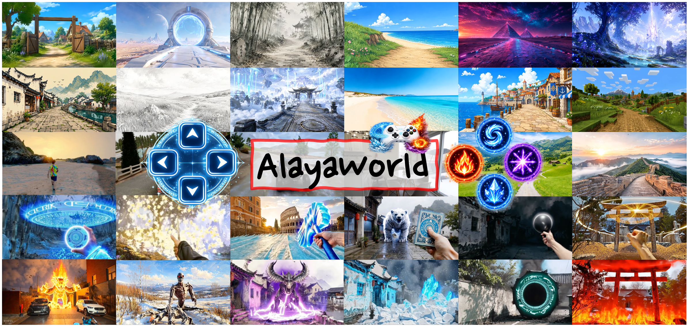

# AlayaWorld: Long-Horizon and Playable Video World Generation

<p align="center"><a href="https://alayalab.ai/"><b>Alaya Lab</b></a></p>

<p align="center">
  <a href="README.md"></a>
  <a href="README_zh.md"></a>
</p>

<p align="center">
  <a href="https://alaya-lab.github.io/AlayaWorld/"></a>
  <a href="https://www.youtube.com/watch?v=n0jIEg7taTI"></a>
  <a href="https://arxiv.org/abs/2607.06291"></a>
  <a href="https://arxiv.org/abs/2607.18367"></a>
  <a href="https://arxiv.org/abs/2608.13492"></a>
  <a href="https://github.com/AlayaLab/AlayaWorld"></a>
  <a href="#weights"></a>
</p>

<p align="center">
  
</p>

> An interactive autoregressive world model with real-time camera control, prompt switching, and long-horizon memory consistency.

---

## 📰 News

- **[2026-08-20]** **Interactive browser demo**: play AlayaWorld live — drive the camera from the keyboard and change the prompt mid-rollout, streamed as it generates. See [`reactor/`](reactor/README.md). Huge thanks to community contributors [@Dere-Wah](https://github.com/Dere-Wah) and [@Rising0321](https://github.com/Rising0321)!
- **[2026-08-17]** Full-stack **training + inference code**, **v1.1 weights** (AR + DMD) and **partial training data** open-sourced, with the [v1.1 technical report](https://arxiv.org/abs/2608.13492). See the [Release Roadmap](#-release-roadmap).
- **[2026-07-21]** [Full Technical Report](https://arxiv.org/abs/2607.18367) released.
- **[2026-07-16]** Inference code released and pretrained weights available on 🤗 [Hugging Face](https://huggingface.co/AlayaLab/AlayaWorld). See [Quick Start](#-quick-start).
- **[2026-07-08]** Project page and [technical report](https://arxiv.org/abs/2607.06291) released.

## 🚀 Release Roadmap

- [x] Inference code
- [x] Pretrained weights — 🤗 [AlayaLab/AlayaWorld](https://huggingface.co/AlayaLab/AlayaWorld)
- [x] Pretrained weights v1.1 — AR: 🤗 [AlayaWorld-v1.1-stage2b](https://huggingface.co/AlayaLab/AlayaWorld-v1.1-stage2b) · DMD: 🤗 [AlayaWorld-v1.1-stage3](https://huggingface.co/AlayaLab/AlayaWorld-v1.1-stage3)
- [x] Training code
- [x] Training data (partial) — 🤗 [AlayaWorld-v1.1-data](https://huggingface.co/datasets/AlayaLab/AlayaWorld-v1.1-data)

## ✨ Core Properties

AlayaWorld is built around four core properties — **interaction**, **consistency**, **stability**, and **runtime**.

### 🎮 Interaction
Two control channels: a rendered 3D cache with lightweight AdaLN camera modulation for grounded, trajectory-aware navigation, and chunk-level prompt switching to introduce new events mid-generation.

### 🧠 Consistency
Two forms of complementary memory: an explicit 3D cache reprojected to the queried view for spatial recall, plus a compressed frame-history embedding for temporal continuity, so revisited places stay recognizable.

### 🛡️ Stability
Long-horizon stability from training on drifted histories and an error bank that re-injects accumulated artifacts into both memory and target, preventing errors from compounding over minute-long rollouts.

### ⚡ Runtime
Real-time interaction via few-step DMD distillation and short temporal chunks, with prompt switching at chunk boundaries to minimize both visual and semantic latency.

## 📁 Repository Layout

```
alaya/          world-model core: config / data / memory / model / trainers
                └── inference/   the da3 streaming case-demo pipeline
ltx2/           LTX-2.3 model stack (DiT / VAE / text encoder / camera control)
fastvideo/      dataset + rollout utilities shared by training
scripts/        finetune/train.sh (unified launcher) · infer/ helpers · tools/
configs/        stage0–stage3 training + three inference configs
inference/      da3 case-demo CLI entry (run.sh / run.py)
reactor/        serve the da3 path as a live, playable stream (+ browser demo)
playground/     bundled demo case (case1)
docs/vigeo/     full training handbook (data format, stages, knobs)
```

One launcher drives everything — training, validation and all three inference
paths — selected purely by the config:

```bash
CONFIG_PATH=configs/<any>.yaml bash scripts/finetune/train.sh
```

## 🏃 Quick Start

**1. Environment** — one Python env covers training and all inference paths
(verified on torch 2.7.1 + CUDA 12.8):

```bash
pip install -r requirements.txt
# Depth-Anything-3 (da3 inference path) is a code repo, install after the pins:
git clone https://github.com/ByteDance-Seed/Depth-Anything-3 third_party/Depth-Anything-3
pip install -e third_party/Depth-Anything-3
```

<a id="weights"></a>
**2. Weights**

| Piece | Used by | Source |
|---|---|---|
| `merged_infer.safetensors` — DiT+VAE+text-enc+history-enc bundle | da3 inference | 🤗 [AlayaLab/AlayaWorld](https://huggingface.co/AlayaLab/AlayaWorld) |
| LTX-2.3 base (`ltx-2.3-22b-dev.safetensors`) | training, AR/DMD inference | 🤗 [Lightricks/LTX-2](https://huggingface.co/Lightricks/LTX-2) |
| AR teacher v1.1 (stage2b, full transformer) | AR inference, stage3 training | 🤗 [AlayaWorld-v1.1-stage2b](https://huggingface.co/AlayaLab/AlayaWorld-v1.1-stage2b) |
| Few-step student v1.1 (stage3 LoRA) | DMD inference | 🤗 [AlayaWorld-v1.1-stage3](https://huggingface.co/AlayaLab/AlayaWorld-v1.1-stage3) |
| Gemma text encoder | everything | 🤗 [google/gemma-3-12b-it-qat-q4_0-unquantized](https://huggingface.co/google/gemma-3-12b-it-qat-q4_0-unquantized) (gated) |
| ViGeo checkpoint (ViGeo1.1) | training, AR/DMD inference | 🤗 [pkqbajng/ViGeo1.1](https://huggingface.co/pkqbajng/ViGeo1.1) (code: [aigc3d/ViGeo](https://github.com/aigc3d/ViGeo)) |
| Depth-Anything-3 weights | da3 inference | 🤗 [depth-anything/DA3NESTED-GIANT-LARGE-1.1](https://huggingface.co/depth-anything/DA3NESTED-GIANT-LARGE-1.1) |

Weight paths live under `paths:` in each config — repoint them to where your
downloads sit. See [`docs/vigeo/README.md`](docs/vigeo/README.md) for the full
layout.

**3. Inference** — three paths, one launch form:

```bash
# a) case demo (da3 spatial memory): first-frame image + camera.pt + prompt -> ~1 min video
CONFIG_PATH=configs/infer.yaml bash scripts/finetune/train.sh
#    equivalent CLI shortcut with per-run flags (seed / rounds / ttc / skill):
bash inference/run.sh                     # bundled playground/case1
python -m inference.run --input playground/case1/case1 --seed 1234 --rounds 45

# b) autoregressive teacher, 30-step (vigeo spatial memory)
VALIDATE_ONLY=1 CONFIG_PATH=configs/infer_i2v_camera_ar.yaml bash scripts/finetune/train.sh

# c) few-step student, 4-step (vigeo spatial memory)
VALIDATE_ONLY=1 CONFIG_PATH=configs/infer_i2v_camera.yaml bash scripts/finetune/train.sh
```

All three render a fixed trajectory to a file. To drive the camera and swap prompts
while generation runs, [`reactor/`](reactor/README.md) serves path a) as a live
stream with a browser demo:

```bash
reactor build -f Dockerfile.reactor
reactor run --gpus device=0 -e HF_TOKEN     # then reactor/demo for the UI
```

Notes: b/c run through the trainer's validation loop, so they need
`VALIDATE_ONLY=1`; a) dispatches straight to the inference pipeline
(`da3_infer.enabled` in the config) and ignores it. The vigeo spatial path is
incompatible with FA3 — launch with `ALAYA_USE_FA3=0` if you built FA3.

Full CLI option list for a): [`inference/README.md`](inference/README.md).

For b/c on your own image + trajectory, `scripts/infer/generate_video.sh`
prepares the inputs (`--image/--prompt` plus `--extrinsics` or `--synth-frames`)
and launches c) in one go. A case for a) is three files sharing a prefix:

```
<prefix>_image.png     first frame (seeds the history)
<prefix>_camera.pt     camera trajectory: cam_c2w [F,4,4] + intrinsics
<prefix>_prompt.txt    text prompt
<prefix>_skill.txt     (optional) prompt for the final seconds (one-off end effect)
```

**4. Training** — four stages, same launcher; each stage's `paths:` points at
the previous stage's checkpoint:

```bash
CONFIG_PATH=configs/stage0_precache.yaml      bash scripts/finetune/train.sh  # VAE-latent + text-embed cache
CONFIG_PATH=configs/stage1_pretrain_bidir.yaml bash scripts/finetune/train.sh # bidirectional pretrain
CONFIG_PATH=configs/stage2a_histpretrain.yaml bash scripts/finetune/train.sh  # history-encoder pretrain
CONFIG_PATH=configs/stage2b_arsft_vigeo.yaml  bash scripts/finetune/train.sh  # autoregressive SFT (ViGeo)
CONFIG_PATH=configs/stage3_dmd_vigeo.yaml     bash scripts/finetune/train.sh  # few-step DMD distillation
```

Dataset download, data format, per-stage details and launcher knobs:
[`docs/vigeo/README.md`](docs/vigeo/README.md).

## 👥 Team

- **Core Lead:** Kaipeng Zhang
- **Lead:** Chuanhao Li
- **Core Contributors:** Chuanhao Li, Kaipeng Zhang, Yifan Zhan, Yongtao Ge, Yuanyang Yin
- **Contributors:** Jiaming Tan, Kang He, Liaoyuan Fan, Mingliang Zhai, Ruicong Liu, Xiaojie Xu, Xuangeng Chu, Zhen Li, Zhengyuan Lin, Zhixiang Wang, Zian Meng, Zihui Gao

## 📬 Contact

For collaboration or business inquiries, contact **kaipeng.zhang@shanda.com**.

## 📝 Citation

If you find AlayaWorld useful for your research, please cite:

```bibtex
@article{team2026alayaworldintro,
  title={AlayaWorld: Long-Horizon and Playable Video World Generation},
  author={Team, AlayaWorld and Zhang, Kaipeng and Li, Chuanhao and Zhan, Yifan and Ge, Yongtao and Yin, Yuanyang and Tan, Jiaming and He, Kang and Fan, Liaoyuan and Liu, Ruicong and others},
  journal={arXiv preprint arXiv:2607.06291},
  year={2026}
}

@article{team2026alayaworldfull,
  title={AlayaWorld: Long-Horizon and Playable Video World Generation},
  author={Team, AlayaWorld and Zhang, Kaipeng and Li, Chuanhao and Zhan, Yifan and Ge, Yongtao and Yin, Yuanyang and Tan, Jiaming and He, Kang and Fan, Liaoyuan and Liu, Ruicong and Zhai, Mingliang and others},
  journal={arXiv preprint arXiv:2607.18367},
  year={2026}
}
@article{team2026alayaworldv11,
  title={AlayaWorld v1.1: Long-Horizon and Playable Video World Generation},
  author={Team, AlayaWorld and Zhang, Kaipeng and Li, Chuanhao and Zhan, Yifan and Ge, Yongtao and Yin, Yuanyang and Tan, Jiaming and He, Kang and Fan, Liaoyuan and Liu, Ruicong and Zhai, Mingliang and others},
  journal={arXiv preprint arXiv:2608.13492},
  year={2026}
}
```

## 📄 License

This project is based on LTX-2 by Lightricks Ltd. Portions of the original LTX-2
codebase (`ltx2/`) have been modified by Alaya Lab for academic and research purposes only, and the released weights
(`merged_infer.safetensors`) are fine-tuned from LTX-2.3. Accordingly, this
project — code and weights — is released under the
[**LTX-2 Community License Agreement**](LICENSE). All original copyright, license,
patent, trademark, and attribution notices from LTX-2 are retained.

**For academic research and non-commercial use only.** For commercial use of
LTX-2 or its derivatives, contact Lightricks Ltd. (entities with ≥ $10M annual
revenue require a commercial license).

See [NOTICE](NOTICE) and [THIRD_PARTY_LICENSES.md](THIRD_PARTY_LICENSES.md) for
full attribution. Third-party weights (Gemma-3 text encoder; Depth-Anything-3) are
**not redistributed** here — obtain them from their original sources under their
own licenses.
