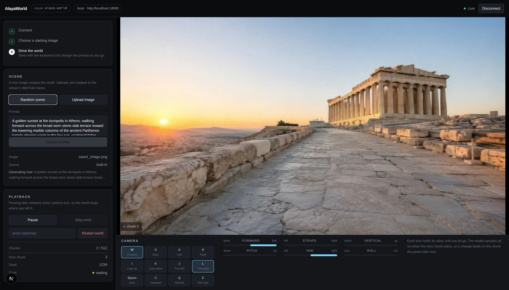

# Play AlayaWorld live

`inference/run.py` renders a fixed camera trajectory to a video file. This serves
the same da3 path as something you steer while it runs: one starting image, a
prompt you can change mid-rollout, and six camera axes you hold on the keyboard,
with each finished chunk streamed to a browser as it is generated.

Nothing about the model changes. The adapter calls `FlashAlayaPipeline` exactly as
the offline path does — `generate`, `finalize`, decode, one turn at a time —
against `alaya/` and `ltx2/` in this repository. What it adds is the interactive
half: normalized camera input expanded into the camera-to-world trajectory the
action and spatial-memory paths already consume, prompt swaps between turns, and
a WebRTC stream out.

Serving runs on [Reactor Runtime](https://github.com/reactor-team/reactor-runtime),
an open-source Python framework that turns an inference loop into a live stream and
handles the transport, the session lifecycle, and command validation. The `reactor`
CLI builds the container and runs it; nothing else installs on the host.

## What you need

- An NVIDIA GPU with enough memory for the da3 path. Verified on a single B200;
  peak VRAM during load is about 60 GB.
- Docker with the NVIDIA Container Toolkit.
- The [`reactor` CLI](https://docs.reactor.inc/deploy/platform/installation) —
  on macOS and Linux, `brew install reactor-team/tools/reactor-cli`.
- A Hugging Face read token for the gated Gemma text encoder. Accept its license
  first, then `export HF_TOKEN=...`.

## Weights

Everything lands in this repository's `checkpoints/`, the same place the rest of
the repo tells you to put weights, so an existing offline-inference setup needs no
rearranging. On first load the adapter fetches whatever is missing:
`merged_infer.safetensors`, the Gemma text encoder, the pinned Depth-Anything-3
checkout and its weights, and the tiny TAEHV decoder. Interrupted Hugging Face
downloads resume on the next start, and later runs verify and reuse what is there.

The CLI mounts `checkpoints/` into the container rather than copying it, so the
weights stay out of the image and survive a rebuild.

## Run it

```sh
export HF_TOKEN=hf_your_read_token

reactor build -f Dockerfile.reactor
reactor run --gpus device=0 -e HF_TOKEN
```

The bare `-e HF_TOKEN` passes the host value without putting the token in the
Docker command line. `--gpus device=3` selects host GPU 3 and presents it as
device 0 inside the container. A different port applies to both Docker and the
runtime:

```sh
reactor run --gpus device=0 -e HF_TOKEN --port 18080
```

Loading takes about a minute and a half: the checkpoint, then one throwaway turn
so the compiled kernels exist before the model reports itself ready. Check it with
the port you passed:

```sh
curl -s localhost:8080/health
curl -s localhost:8080/schema
```

`/health` reports `state: available` once loading and warmup are done. `/schema`
is the command surface below, as OpenAPI.

Without Docker (e.g. inside a managed GPU container that has no daemon), the
runtime can also be started directly — install `reactor/requirements.txt` into a
Python ≥ 3.12 environment and run, from the repository root:

```sh
REACTOR_WEIGHTS_PATH=$PWD/checkpoints HOST=0.0.0.0 PORT=8080 \
  python -m reactor_runtime.serve
```

`REACTOR_WEIGHTS_PATH` matters: it is what the CLI normally mounts, and without
it the runtime falls back to `~/.cache/reactor_registry` and re-downloads the
26 GB checkpoint there even when `checkpoints/` is already populated.

## Play it in the browser

[`demo/`](./demo) is a small Next.js app for exactly this model: pick a starting
image, write a prompt, and drive the camera from the keyboard.



With the container running, start it in a second terminal:

```sh
cd reactor/demo
pnpm install
pnpm dev
```

Open [http://localhost:3000](http://localhost:3000). The page walks through three
steps — connect, choose a starting image, then drive — and says which one it is
waiting on, so a control that is unavailable explains itself.

`W`/`A`/`S`/`D` move, `I`/`J`/`K`/`L` look, `Space`/`C` change height, `Q`/`E`
roll. Looking is on the keyboard rather than the mouse because the model samples
one velocity per axis per turn, so mouse deltas would be averaged into a single
number instead of felt. [`demo/README.md`](./demo/README.md) covers the rest.

The app connects to `http://localhost:8080` with no configuration. If you passed
`--port`, say so:

```sh
cp .env.example .env
# REACTOR_LOCAL_URL=http://localhost:18080
```

To exercise the upload path, any of the `playground/case*/case*_image.png` files
work as a starting image.

## Commands

A turn is 4 latent frames — 32 RGB frames, about 1.33 seconds of video. Prompt and
camera values are sampled at the chunk boundary, so a command that arrives during
a turn applies to the next one. Every command returns a typed confirmation naming
the chunk it will first affect, and broadcasts a complete state snapshot.

| Command | Effect |
| --- | --- |
| `set_image` | Upload a JPEG, PNG, WebP, or BMP and restart the rollout from it |
| `random_image` | Start from one of the bundled `playground/` cases and its prompt |
| `set_prompt` | Change the text condition for the next turn, without restarting |
| `set_forward`, `set_strafe`, `set_vertical` | Local Z, X, Y translation; positive is forward, right, up |
| `set_pitch`, `set_yaw`, `set_roll` | Local X, Y, Z rotation; positive looks up, turns right, rolls clockwise |
| `set_paused` | Stop before the next turn, releasing all camera motion |
| `step` | Generate exactly one turn while paused |
| `reset` | Rebuild the rollout from the same image, with an optional seed |

Each camera axis takes a velocity from `-1.0` to `1.0` and holds it until it is
replaced, so a key press and a key release are one command each. A prompt or
camera command needs an image first; prompts are trimmed and must be non-empty.

`state_update` carries everything a client can observe — image, prompt, seed,
pause state, completed and next chunk, and all six velocities — and is sent to
each viewer as it joins, so a second tab agrees with the first.

## Performance

Two things in `reactor/alayaworld.yaml` matter most, both on by default:

- `attention_backend: flash_attention_4` serves unmasked attention with
  FlashAttention 4, which needs a Hopper or Blackwell GPU. `pytorch` serves
  anything older, and `upstream` leaves the repository's own selection in place.
  Masked blocks always fall through to the PyTorch implementation, the only one
  that builds the banded mask a sliding window needs. The adapter substitutes the
  callable on the loaded attention modules; it does not patch `ltx2/`.
- `bank_taehv: true` decodes spatial-memory pixels with the tiny TAEHV decoder
  instead of the full VAE. It is lossy for the depth and warp sources the memory
  is built from, and leaves the frames a client sees untouched.

Together, on one B200, they take a turn from 7.4 to 3.2 seconds with the camera
still, and frames delivered to the browser from 4.1 to 9.7 per second. Turning the
camera is cheaper than standing still, so continuous motion reads more smoothly
than pausing.

`warmup_chunks: 1` generates a throwaway turn during load, because compiled
kernels are built on the first turn that reaches them and FlashAttention adds its
own. Set it to `0` to serve sooner and pay that cost on the first client's first
chunk. The compile caches live in the container, so a restart pays it again.

Playback is paced by measurement rather than a fixed frame rate: a turn takes
longer than the video it produces, so each chunk is emitted with the time it took
and plays at the rate it was produced. Without that, 32 frames drain in 1.33
seconds and the stream has nothing to show until the next turn lands.

## Long rollouts

`stream.max_chunks_per_rollout` defaults to 512. After that many turns the adapter
rebuilds the rollout from the same image, prompt, and seed without reloading
weights, and numbering restarts at 1. This bounds the dense camera trajectory while
the session continues.

Autoregressive history stays a 16-latent sliding window, and the spatial bank is
bounded at 320 frames: 160 recent, plus 160 keyframes sampled across the older
trajectory. Very old revisits therefore carry less spatial detail than recent ones
— a deliberate trade of unbounded history for predictable memory.

The VAE is not causal, so each chunk decodes with six latents of left context
rather than re-decoding the whole history. At the live edge that cannot be
pixel-identical to a future-aware offline decode.

## Credits

The initial port of AlayaWorld to Reactor was written by **Ruixing Zhang**
([@Rising0321](https://github.com/Rising0321)); this contribution builds directly
on that work.

## Licensing

Serving does not change what the model is or how it is licensed. AlayaWorld and its
weights remain under the LTX-2 Community License, for academic and non-commercial
use, and Gemma and Depth-Anything-3 keep their own terms — see the repository's
[NOTICE](../NOTICE) and [THIRD_PARTY_LICENSES.md](../THIRD_PARTY_LICENSES.md).
Nothing here redistributes weights; they are downloaded from their original
sources.
